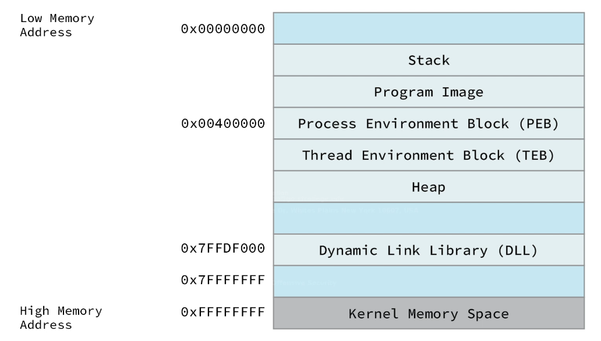
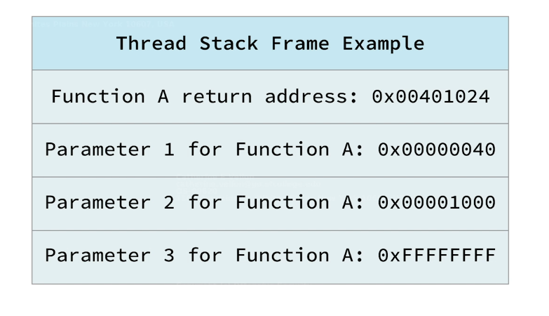
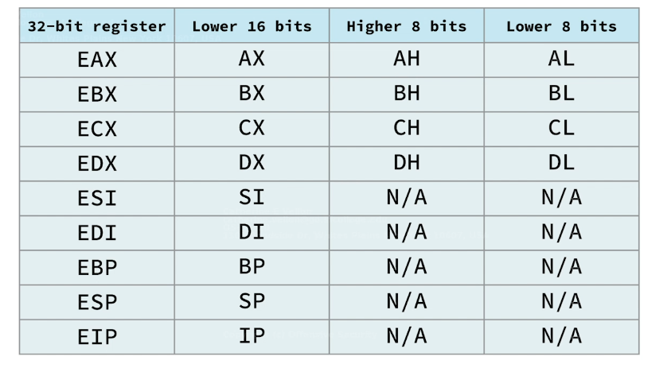
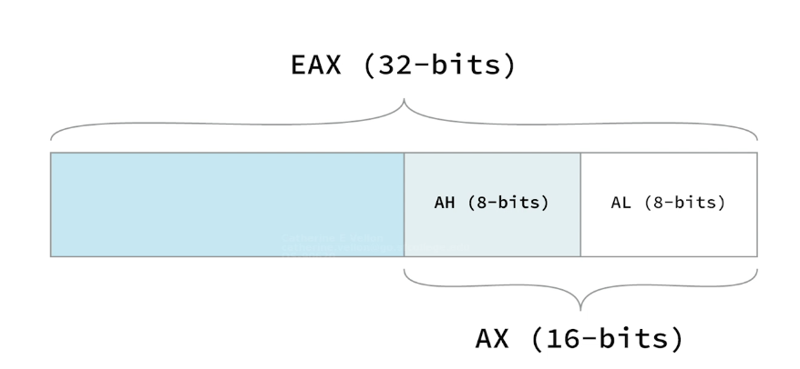

# Buffer Overflow 
- A type of a memory corruption Vulnerability
-can be used to control the exectution flow of an application 

## Introduction To The X_86 Architecture
# Program Memory
 an executed binary application allocates memory in a very specific way, within the memory boundaries used by the modern computers
 
 Process Memory Allocation in windows Btwn The lowest and the highest memory addresses
 
 
# The Stack
 a running thread executes code within the program image or from various dll's loaded by the application
 the thread requires a short term data area for functions, local variables and  pc info , the data area is called the stack
 Each thread in a running app has it's own stack to facilitate execution of multiple threads
 items pushed on the stack are popped 1st (LIFO)
 x_86 arch implements dedicated push and pop asm instructions in order to add or remove data from the stack
 
# Function Return Mechanics
 When code within a thread calls a func, it must know which addr to return to once the func completes, the return addr along with the func params and local vars is stored in the stack. this coll of data is associated with one func call and is stored in a stack frame (A section of the stack memory)
 
 when a func ends, the RA is taken from the stack and used to restore the exec flow back to the main prog or the calling func.
 
# Cpu Registers
Small extreemely high speed cpu storage locations where data can be effeciently read or manipulated(They aid in performing effecient code exec)
They are  9, 32bit
 Their names were initially established for 16bits registers and then were extended with the advent the 32bit platform
 
 E in the registers accronyms means extended
  
  Each register may contain a 32, 16 or 8 bit value in the respective sub-registers
  
  
# General Purpose Registers
 Used to store temporary data
 - EAX - Accumulator = used for Arithmetical n Logical Instructions
 - EBX - Base Pointer For Memory Addresses
 - ECX - Count Register used for Loop, Shift and Rotation Counter
 - EDX - Used For I/O port addressing , Multipplication and division
 - ESI - Source Index Used as A pointer addressing the data source in string copy operations 
 - EDI - Destination index used as a pointer addressing the destination memory buffer in string copy operations  
 
# ESP, EBP and EIP 
 - ESP - The Stack Pointer = keeps the track of the most recently referenced location on the stack by storing a pointer to it
 - ->a pointer is a ref to an address or a location in memory 
 registers store target address
 -Since the stack is in constant flux storing the execution of a thread, it's hard for a func to locate it's own stack frame, therefore need for an ebp 
 - EBP - The Base Pointer = Stores a pointer to the top of the stack when a func is called  
 A func can esily ref info from its own stack frame via offsets while exec
 - EIP- The Instruction Pointer = always points to the next code instruction to be executed (Directs the flow of a program)
 
## Vulnerable Code Walkthrough
This app does not perform a proper sanitization of the user input

TO DO:
- Analyze the program source code
- Discover that passing a specifically crafted arg will be able to cleate a stack buffer

```C

#include <stdio.h>
#include <strings.h>

int main(int argc, char *argv[])
{
   char buffer[64];
   
   if (argc < 2 )
   { 
        printf("Error - you must supply at least one arguement\n");
        
        return 1;
      }
   
      strcpy(buffer, argv[1]);
   
   return 0;
}

```
In C, the main program is treated like every other functions, it can receive args, return values, etc
The only diff is that it is called by the OS itself when the process starts

in the above code, the main func 1st defines a char array 'buffer' that can only receive 64 chars
The c compiler treats the char as a local variable as it is defined within a func, space is reserved within the main funcs stack frame during its exec when the prog runs

the prog copies the contents of the given smd line args into the char array 
the prog terminates it's exec and returns a 0 to the os which is the standard exit code for success

the prog requires cmd args to run, which are then processed by the main func with the help of argc and argv 
argc - no of args passed to the prog 
argv - the array of pointers to the strings themselves

Program before strcpy


if the arg passed to the prog is 64 or less bytes, the prog works as expected and execs normally


Since there are no checks on the size of the input, part of the stack adjacent to the local buffer get's overwritten by the exceeding characters , overflowing the array boundaries 


The effects of this mem corruption depend on various factors including :
-The size of the overflow
-The data included in the overflow  

We can apply an ovesized arg to our ap and observe the effects to see how the above works

## The Immunity Debugger 
Debugger - acts as a proxy btwn the prog and the cpu , it also allows us to stop the exec flow and allows us to view the content of the registers as well as the process mem space
-we can also exec asm instructions one at a time to better understand the detailed flow of the prog


